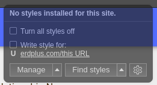
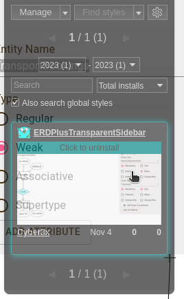

# Custom styles for ERDPlus for QOL changes
This style makes the properties panel transparent when nothing is selected. When something is selected, only the panel behind inputs has the bacground. The rest is transparent giving you more space to see your model.

#### Installation
1. Install [Stylus](https://github.com/openstyles/stylus?tab=readme-ov-file#releases) browser extension
2. Click on the extension icon

3. Click on the "Find styles" button
    
4. Select the first extension

### Instalation done